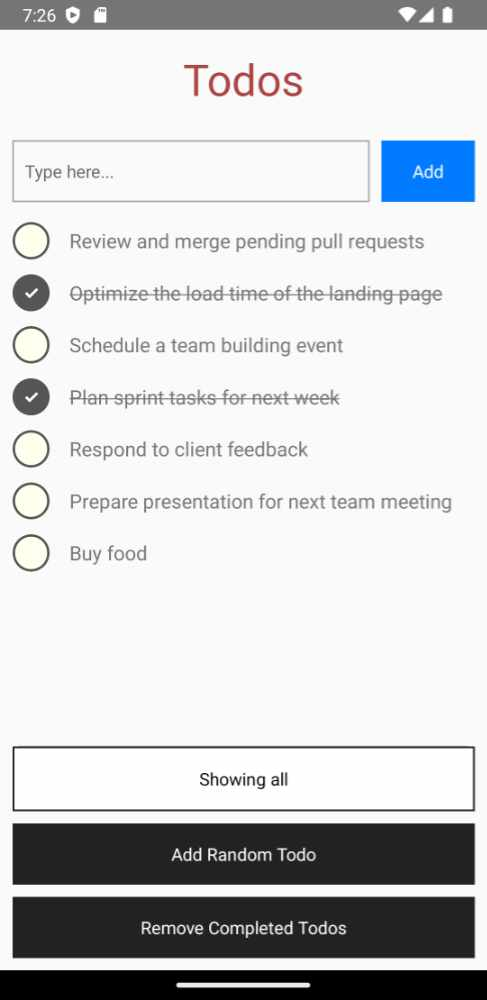

# What is it?

The `TodoAppReactNative` is a React Native + TypeScript mobile app to demonstrate the use of Async
Redux.



# To build and run using IntelliJ

1. Select `Edit Configuration...` in the toolbar.
2. Click the `+` button and select `React Native`. A window will open.
4. In `Name`, write `BUILD AND RUN`.
6. Press the `OK` button to save.
7. In the toolbar, click the green "run" button.

## Dependency

In it's `package.json` file it adds Async Redux as a dependency like this:

```json
{
  "dependencies": {
    "async-redux-react": "^1.1.1"
  }
}
```

## Importing

To import Async Redux from `TodoAppReactNative`:

```ts
import { Store, ReduxAction } from 'async-redux-react';
```

## Resetting everything in Windows:

> Remove-Item -Recurse -Force node_modules
> npm cache clean --force
> Remove-Item package-lock.json -Force
> npm install
> npx react-native start --reset-cache  

## Resetting everything in the Mac:

> shell rm -rf node_modules/ 
> npm cache clean --force 
> rm package-lock.json 
> npm install 
> npx react-native start --reset-cache


