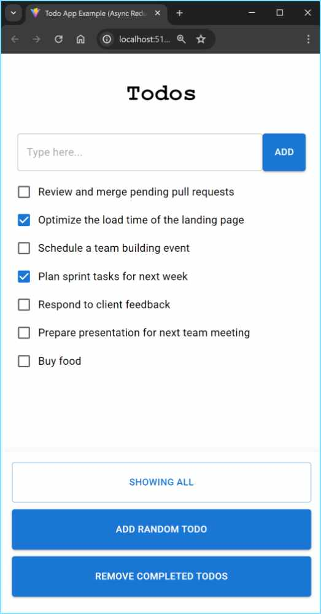

# What is it?

The `todo-app-example` is a Vite + TypeScript + React web page to demonstrate the use of Async
Redux.
                          


# To build and run using IntelliJ

1. Select `Edit Configuration...` in the toolbar.
2. Click the `+` button and select `npm`. A window will open.
3. In `package.json` provide the path to this file:
   `[something]\async-redux-react\examples\todo-app-example\package.json`
4. In `Command`, select `run`.
5. In `Scripts`, select `dev`.
6. Press the `OK` button to save.
7. In the toolbar, click the green "run" button.

## Note

This project was created following https://vitejs.dev/guide:

```s
npm create vite@latest todo-app-example -- --template react-ts
```

## Dependency

In it's `package.json` file it adds Async Redux as a dependency like this:

```json
{
  "dependencies": {
    "async-redux-react": "file:/../../"
  }
}
```

That's because `todo-app-example` is inside Async Redux itself, in the `examples` directory.
If you run it from an independent project, you'll need to include Async Redux from npm like this:

```json
{
  "dependencies": {
    "async-redux-react": "^1.0.0"
  }
}
```

But be sure to use the newest package version.

## Importing

To import Async Redux from `todo-app-example`:

```ts
import {Store, ReduxAction} from 'async-redux-react';
```
